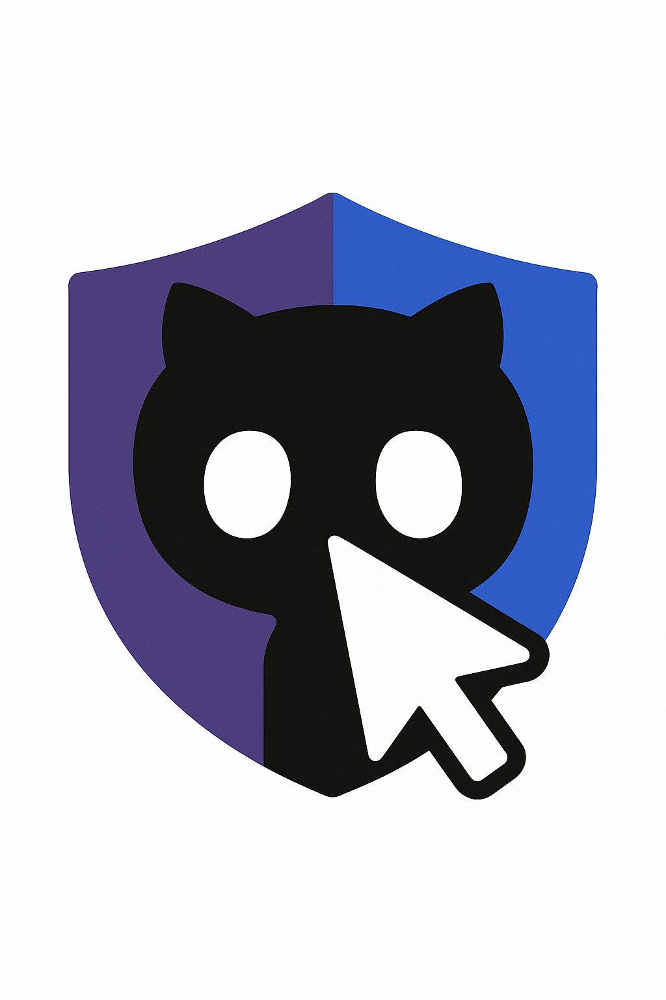

# SpecCursor

[](https://opensource.org/licenses/MIT)
[](https://codecov.io/gh/speccursor/speccursor)
[](https://snyk.io/test/github/speccursor/speccursor)
[](https://github.com/orgs/speccursor/packages)
[](https://leanprover.github.io/)
[](https://anthropic.com/claude)

> Autonomous dependency upgrades, AI-powered regression patches, and formal verification using Lean 4.20.0

## Overview

SpecCursor is a GitHub App that autonomously upgrades dependencies, patches regressions using AI, and proves invariants using Lean 4.20.0. It provides a complete solution for maintaining software dependencies with confidence through formal verification.

<p align="center">
  
</p>

### Key Features

- **AI-Powered Patching**: Uses Claude Sonnet 4 to generate regression patches
- **Formal Verification**: Leverages Lean 4.20.0 with Mathlib4 for invariant proofs
- **Multi-Ecosystem Support**: Node.js (pnpm), Rust (cargo), Python (pip), Go (go modules), Dockerfile
- **Security First**: Sandboxed execution, comprehensive threat modeling, and security scanning

## Quick Start

### Prerequisites

- Node.js 18+ with pnpm
- Rust 1.70+
- Go 1.21+
- Python 3.11+
- Docker & Docker Compose
- Lean 4.20.0

### Development Setup

```bash
# Clone the repository
git clone https://github.com/speccursor.git

# Install dependencies
pnpm install

# Start local development environment
pnpm dev:up

# Run tests
pnpm test

# Build all packages
pnpm build
```

### Docker Setup

```bash
# Start all services
docker-compose up -d

# View logs
docker-compose logs -f

# Stop services
docker-compose down
```

## Architecture

SpecCursor follows a microservices architecture with clear separation between control-plane and execution sandboxes:

- **Control Plane**: Controller Service, State Store (PostgreSQL), Cache Store (Redis)
- **Execution Sandboxes**: Worker Pool (Rust), AI Service (Node.js), Lean Engine (Lean 4.20.0)
- **Observability**: Prometheus, OpenTelemetry, Loki, Grafana

For detailed architecture documentation, see [docs/architecture/README.md](docs/architecture/README.md).

## Development

### Project Structure

```
speccursor/
├── apps/                    # Application services
│   ├── github-app/         # GitHub App (Node.js/TypeScript)
│   ├── controller/         # Controller Service (Node.js/TypeScript)
│   └── ai-service/         # AI Service (Node.js/TypeScript)
├── workers/                 # Worker implementations
│   ├── rust-worker/        # Rust Worker Pool
│   └── lean-engine/        # Lean 4.20.0 Proof Engine
├── packages/                # Shared packages
│   ├── shared-types/       # TypeScript type definitions
│   ├── shared-utils/       # Shared utilities
│   └── shared-config/      # Configuration management
├── infrastructure/          # Infrastructure as Code
│   ├── terraform/          # AWS infrastructure
│   └── docker/             # Docker configurations
├── docs/                   # Documentation
│   ├── architecture/       # Architecture documentation
│   └── api/               # API documentation
└── tools/                  # Development tools
    ├── scripts/           # Build and deployment scripts
    └── ci/                # CI/CD configurations
```

### Available Scripts

```bash
# Development
pnpm dev:up          # Start development environment
pnpm dev:down        # Stop development environment
pnpm dev:logs        # View development logs

# Testing
pnpm test            # Run all tests
pnpm test:unit       # Run unit tests
pnpm test:integration # Run integration tests
pnpm test:coverage   # Generate coverage report

# Building
pnpm build           # Build all packages
pnpm build:clean     # Clean build artifacts
pnpm build:docker    # Build Docker images

# Linting & Formatting
pnpm lint            # Run all linters
pnpm lint:fix        # Fix linting issues
pnpm format          # Format all code

# Security
pnpm security:scan   # Run security scans
pnpm security:audit  # Audit dependencies

# Deployment
pnpm deploy:staging  # Deploy to staging
pnpm deploy:prod     # Deploy to production
```

## Contributing

We welcome contributions! Please see [CONTRIBUTING.md](CONTRIBUTING.md) for guidelines.

### Development Workflow

1. Fork the repository
2. Create a feature branch (`git checkout -b feature/amazing-feature`)
3. Make your changes following our coding standards
4. Add tests for new functionality
5. Ensure all tests pass (`pnpm test`)
6. Run security scans (`pnpm security:scan`)
7. Commit your changes (`git commit -m 'Add amazing feature'`)
8. Push to the branch (`git push origin feature/amazing-feature`)
9. Open a Pull Request

### Code Standards

- **TypeScript**: Strict mode, ESLint + Prettier
- **Rust**: rustfmt, clippy, cargo-audit
- **Go**: gofmt, golangci-lint, go mod tidy
- **Python**: black, flake8, mypy
- **Lean**: lake build, lean --check

## Security

SpecCursor follows security-first principles:

- **Threat Modeling**: Comprehensive STRIDE-based threat analysis
- **Sandboxed Execution**: Firecracker/gVisor for isolation
- **Security Scanning**: Snyk, Trivy, Gitleaks integration
- **Secret Management**: AWS Secrets Manager integration
- **Container Security**: Non-root, read-only filesystems

See [docs/architecture/threat-model.md](docs/architecture/threat-model.md) for detailed security documentation.

## Monitoring & Observability

- **Metrics**: Prometheus with custom metrics
- **Tracing**: OpenTelemetry with Jaeger
- **Logging**: Structured JSON logs with Loki
- **Dashboards**: Grafana with pre-built dashboards
- **Alerting**: Alertmanager with PagerDuty integration

## License

This project is licensed under the MIT License - see the [LICENSE](LICENSE) file for details.

## Support

- [Issue Tracker](https://github.com/speccursor/speccursor/issues)
- [Discussions](https://github.com/speccursor/speccursor/discussions)
- [Email Support](mailto:support@speccursor.dev)

## Roadmap

- [ ] **v1.0.0**: Core GitHub App with Node.js ecosystem support
- [ ] **v1.1.0**: Rust ecosystem support
- [ ] **v1.2.0**: Python ecosystem support
- [ ] **v1.3.0**: Go ecosystem support
- [ ] **v2.0.0**: Advanced Lean integration with custom theorem proving
- [ ] **v2.1.0**: Multi-repository dependency analysis
- [ ] **v2.2.0**: Machine learning for patch quality prediction

---

**Built with ❤️ by the SpecCursor team**
